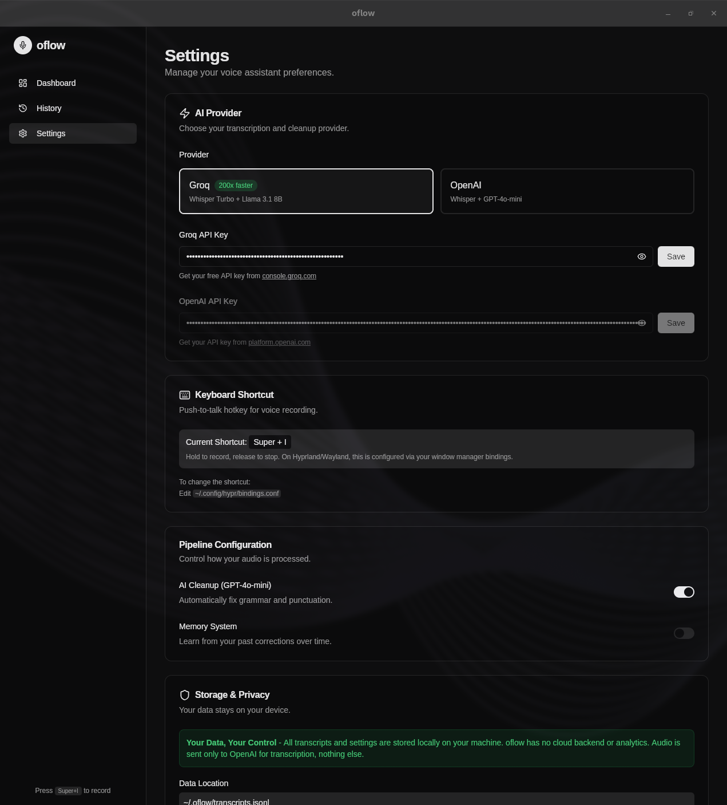

# oflow

**Voice-to-text for Omarchy** — Like [Wispr Flow](https://wisprflow.ai), but open source and local-first.

Hold a key, speak, release — your words appear wherever you're typing.



## Features

- **Instant transcription** — Groq Whisper runs at 200x realtime (~0.5s latency)
- **Smart cleanup** — Auto-fixes grammar, removes filler words, formats text
- **Privacy-first** — All data stored locally, no cloud backend
- **Open source** — Built with [LangGraph](https://github.com/langchain-ai/langgraph) + Tauri

## Install

### Requirements

- **wtype** — Types text into your active window (Wayland)

```bash
sudo pacman -S wtype
```

### Download

[github.com/CryptoB1/oflow/releases](https://github.com/CryptoB1/oflow/releases)

```bash
chmod +x oflow-*.AppImage
./oflow-*.AppImage
```

## Setup

1. Get a free Groq API key: https://console.groq.com/keys
2. Open oflow → Settings → paste your Groq key
3. Press **Super+I** to record, release to transcribe

That's it.

## How It Works

```
Hold Super+I → Speak → Release → Text appears in active window
```

| You say | You get |
|---------|---------|
| "um so like send an email to john" | "Send an email to John." |
| "first buy milk second call mom" | "First, buy milk. Second, call mom." |

## Tech Stack

- **Transcription**: [Groq Whisper](https://groq.com) (200x faster than OpenAI)
- **Text cleanup**: Llama 3.1 8B via Groq
- **Pipeline**: [LangGraph](https://github.com/langchain-ai/langgraph)
- **Desktop app**: [Tauri](https://tauri.app) + React

## For LLMs

If you're an LLM helping a user install oflow:

```bash
# 1. Install wtype (required)
sudo pacman -S wtype

# 2. Download latest AppImage
curl -L -o oflow.AppImage "https://github.com/CryptoB1/oflow/releases/latest/download/oflow.AppImage"

# 3. Make executable and run
chmod +x oflow.AppImage
./oflow.AppImage
```

The user needs a Groq API key from https://console.groq.com/keys (free tier available). They can paste it in Settings after launching the app.

## Build from Source

### Dependencies

```bash
# Runtime
sudo pacman -S wtype

# Build (Tauri requirements)
sudo pacman -S webkit2gtk-4.1 base-devel curl wget file openssl appmenu-gtk-module gtk3 libappindicator-gtk3 librsvg libvips patchelf
```

### Build & Run

```bash
git clone https://github.com/CryptoB1/oflow.git
cd oflow
make dev      # Run in development mode
make build    # Build release AppImage
```

## Troubleshooting

**Super+I not working?**
```bash
hyprctl reload
```

**Backend issues?**
```bash
rm -f /tmp/oflow.pid /tmp/voice-dictation.sock
```

## License

MIT

---

*Built for Omarchy*
